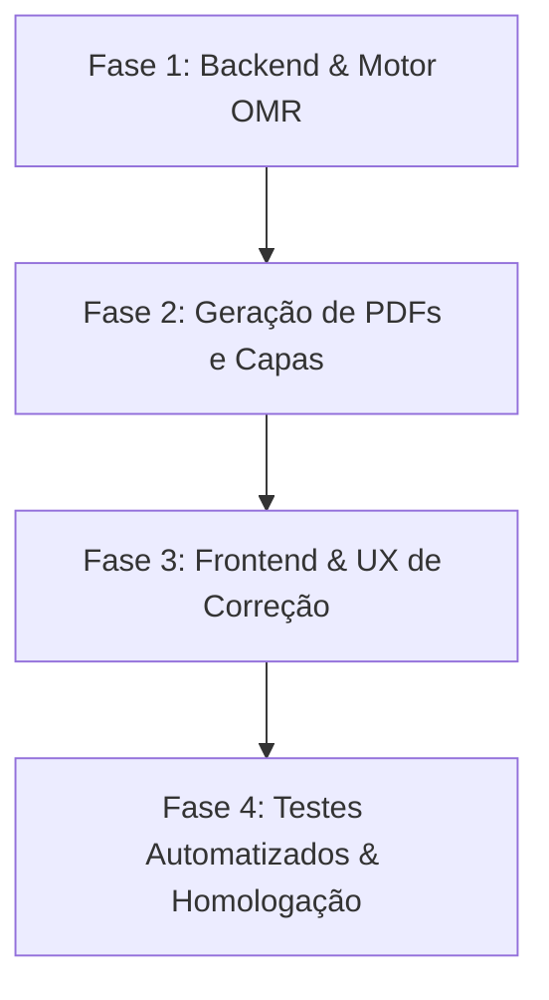

# Plano de Implementação: Capa de Prova Inteligente com Detecção OMR Dual-Template

Este documento estabelece o roteiro de integração do novo recurso de **Capa de Prova Integrada com Gabarito OMR (Padrão Oficial Canoa 2026)** no sistema de correção de provas, permitindo a convivência harmoniosa entre o **Gabarito Tradicional** e a **Capa da Prova**, selecionados automaticamente pela posição do QR Code.

---

## 📌 Visão Geral do Recurso

Atualmente, o sistema corrigia exclusivamente folhas no padrão de gabarito tradicional (folha inteira A4 ou 2 por página A5). O novo recurso introduz a **Capa da Prova com Folha de Respostas Integrada**, dispensando a impressão separada de cadernos de prova e folhas de gabarito.

### Regra de Ouro (Classificação Determinística OMR):
- **QR Code no Topo (`y < 45%` da folha)** $\rightarrow$ **Gabarito Oficial Tradicional** (Template ReportLab, $Y_{\text{início}} = 363\text{px}$).
- **QR Code na Base (`y \ge 45%` da folha)** $\rightarrow$ **Capa da Prova Canoa 2026** (Template Opção 4 Azul Náutico, $Y_{\text{início}} = 225\text{px}$).

---

## 🎯 Escopo e Fases de Implementação

---

## Fase 1: Padronização no Backend e Motor OMR

### 1.1 Persistência e Metadados da Submissão
- **Arquivos:** [`backend/app/services/omr_engine.py`](file:///c:/Users/Douglas/Downloads/Correção%20de%20provas/backend/app/services/omr_engine.py) e [`backend/app/services/database.py`](file:///c:/Users/Douglas/Downloads/Correção%20de%20provas/backend/app/services/database.py)
- **Ações:**
  - Armazenar `sheet_type` (`"capa_prova"` ou `"gabarito_oficial"`) no registro da submissão no banco de dados SQLite.
  - Armazenar `qr_position` (`"bottom"` ou `"top"`) no log de auditoria da submissão.
  - Assegurar que ao reprocessar ou consultar uma prova corrigida, o tipo de folha utilizado seja identificado com clareza.

---

## Fase 2: Módulo de Emissão da Capa da Prova

### 2.1 Serviço Unificado de Geração de Capas
- **Arquivo:** [`backend/app/services/cover_generator.py`](file:///c:/Users/Douglas/Downloads/Correção%20de%20provas/backend/app/services/cover_generator.py) (Novo Módulo)
- **Ações:**
  - Criar função centralizada `generate_exam_cover(exam_id, student_id=None, class_id=None)` que:
    1. Injeta os dados da instituição (Prefeitura de Lagoa da Canoa / SEMED).
    2. Insere os metadados do aluno, turma, escola e disciplina.
    3. Gera o QR Code calibrado no canto inferior direito com margem de segurança de **10.8 mm** em relação ao marcador ArUco 2.
    4. Renderiza as tabelas de 4 alternativas ($A, B, C, D$) com coordenadas calibradas (12 linhas por coluna para até 24 questões).
    5. Converte para PDF vetorial de alta definição (300 DPI) via WeasyPrint / Chrome Headless.

### 2.2 Endpoints de API para Impressão
- **Arquivo:** [`backend/app/api/exams.py`](file:///c:/Users/Douglas/Downloads/Correção%20de%20provas/backend/app/api/exams.py)
- **Rotas:**
  - `GET /api/exams/{exam_id}/cover-pdf` $\rightarrow$ Gera a capa em branco da prova para impressão em lote.
  - `GET /api/exams/{exam_id}/students/{student_id}/cover-pdf` $\rightarrow$ Gera a capa nominal personalizada do aluno com QR Code individual.
  - `GET /api/exams/{exam_id}/classrooms/{classroom_id}/covers-zip` $\rightarrow$ Pacote ZIP com todas as capas nominais da turma prontas para impressão.

---

## Fase 3: Interface Web (Frontend) e Experiência do Usuário

### 3.1 Painel de Provas & Impressão
- **Arquivos:** [`frontend/index.html`](file:///c:/Users/Douglas/Downloads/Correção%20de%20provas/frontend/index.html) e [`frontend/app.js`](file:///c:/Users/Douglas/Downloads/Correção%20de%20provas/frontend/app.js)
- **Ações:**
  - Na listagem de Simulados/Provas, adicionar botão de ação:
    - **"Imprimir Gabaritos Padrão"** (Gabarito tradicional A4/A5).
    - **"Imprimir Capas de Prova Canoa 2026"** (Novo recurso: capa com folha de respostas integrada).
  - Modal de seleção: permitir imprimir para turma inteira (com nomes e QR Code) ou folha avulsa em branco.

### 3.2 Feedback Visual no Scanner / Modal de Auditoria (Raio-X)
- **Ações:**
  - No card de confirmação de leitura da prova escaneada, exibir badge visual:
    - 🏷️ **Capa da Prova** (Azul Petróleo / Náutico) quando `sheet_type === "capa_prova"`.
    - 🏷️ **Gabarito Tradicional** (Cinza Slate) quando `sheet_type === "gabarito_oficial"`.
  - Exibir a imagem do **Raio-X** destacando as alternativas identificadas com alinhamento pixel a pixel e nota já calculada.

---

## Fase 4: Testes Automatizados & Homologação Contínua

### 4.1 Suíte de Testes de Regressão OMR
- **Arquivo:** [`backend/tests/test_omr_dual_template.py`](file:///c:/Users/Douglas/Downloads/Correção%20de%20provas/backend/tests/test_omr_dual_template.py) (Novo Teste)
- **Casos de Teste:**
  1. **Teste Capa Marcada:** Submeter `capa_teste_opcao4_adryel_8bm_marcada.png` $\rightarrow$ esperar `sheet_type="capa_prova"`, `qr_pos="bottom"` e nota 22/22 (100%).
  2. **Teste Capa em Branco:** Submeter `capa_teste_opcao4_adryel_8bm.png` $\rightarrow$ esperar 0 acertos e alinhamento do Raio-X.
  3. **Teste Gabarito Tradicional A4:** Submeter folha A4 com QR no topo $\rightarrow$ esperar `sheet_type="gabarito_oficial"`, `qr_pos="top"`.
  4. **Teste Gabarito Tradicional A5 (2 por folha):** Submeter folha A5 $\rightarrow$ esperar `is_compact=True`, `sheet_type="gabarito_oficial"`.
  5. **Anti-Regressão:** Nenhuma folha existente pode sofrer perda de pontuação ou desvio do Raio-X.

---

## 📋 Matriz de Arquivos Afetados

| Componente | Arquivo | Ação | Descrição |
| :--- | :--- | :---: | :--- |
| **OMR Engine** | [`backend/app/services/omr_engine.py`](file:///c:/Users/Douglas/Downloads/Correção%20de%20provas/backend/app/services/omr_engine.py) | `CONCLUÍDO` | Condicional de posição do QR Code + suporte a dual-template |
| **PDF Generator** | [`backend/app/services/pdf_generator.py`](file:///c:/Users/Douglas/Downloads/Correção%20de%20provas/backend/app/services/pdf_generator.py) | `CONCLUÍDO` | Roteamento explícito `get_cover_template` quando `is_cover=True` |
| **Cover Service** | `backend/app/services/cover_generator.py` | `NOVO` | Serviço centralizado de geração HTML $\rightarrow$ PDF das capas |
| **API Endpoints** | [`backend/app/api/exams.py`](file:///c:/Users/Douglas/Downloads/Correção%20de%20provas/backend/app/api/exams.py) | `MODIFICAR` | Adicionar endpoints para download de capas nominais e em lote |
| **Database** | [`backend/app/services/database.py`](file:///c:/Users/Douglas/Downloads/Correção%20de%20provas/backend/app/services/database.py) | `MODIFICAR` | Persistir `sheet_type` e `qr_position` nas submissões |
| **Frontend UI** | [`frontend/app.js`](file:///c:/Users/Douglas/Downloads/Correção%20de%20provas/frontend/app.js) & [`frontend/index.html`](file:///c:/Users/Douglas/Downloads/Correção%20de%20provas/frontend/index.html) | `MODIFICAR` | Botões de emissão de capas e badges visuais na correção |
| **Testes** | `backend/tests/test_omr_dual_template.py` | `NOVO` | Testes automatizados cobrindo ambos os layouts |

---

## 🔒 Critérios de Aceitação

- [x] O motor OMR reconhece automaticamente a folha como **Capa de Prova** caso o QR Code esteja na parte inferior.
- [x] O motor OMR reconhece automaticamente a folha como **Gabarito Tradicional** caso o QR Code esteja no topo.
- [x] O Raio-X (overlay de inspeção) centraliza os círculos coloridos exatamente sobre as bolhas em ambos os formatos.
- [x] Os gabaritos oficiais antigos continuam lendo normalmente com 100% de precisão (zero regressão).
- [ ] Usuários podem baixar e imprimir tanto o Gabarito Tradicional quanto a Capa de Prova Canoa 2026 diretamente pela interface web.
- [ ] A tela de confirmação de correção informa se a folha lida foi uma Capa da Prova ou um Gabarito Oficial.
