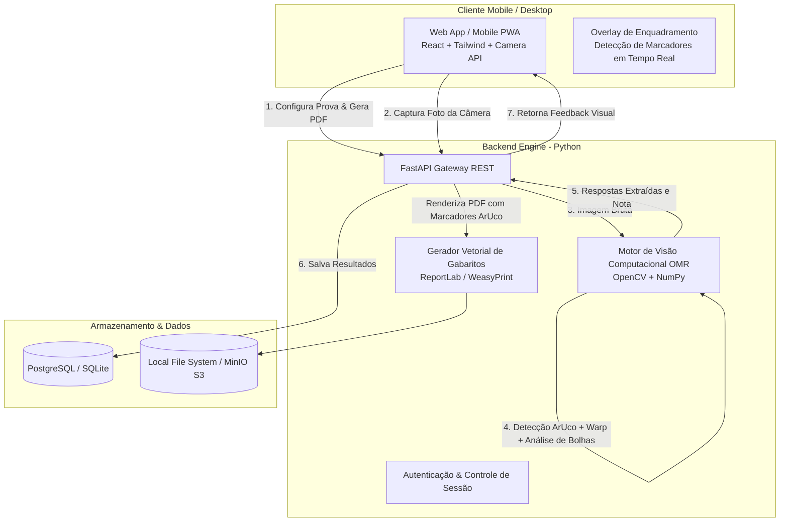

# PRD - Sistema Open-Source de Geração e Correção de Gabaritos via Câmera (OMR)

> **Versão:** 1.0.0  
> **Status:** Aprovado para Arquitetura & Planejamento  
> **Autor:** Antigravity Project Planner & Architecture Agent  
> **Data:** Setembro de 2026  

---

## 1. Visão Geral do Produto

### 1.1 Problema
Professores, coordenadores e instituições de ensino gastam dezenas de horas corrigindo provas e simulados manualmente. Leitores ópticos dedicados tradicionais (scanners industriais de OMR) custam milhares de reais e exigem formulários específicos e rígidos. Soluções de mercado cobram mensalidades abusivas por aluno/mês.

### 1.2 Solução
Uma plataforma **100% open-source, autohospedável (self-hosted) e de custo zero de licenciamento**, composta por:
1. **Gerador Dinâmico de Folhas de Resposta:** Permite configurar qualquer prova/simulado (número de questões, quantidade de alternativas [A-D, A-E], pesos por questão, gabarito oficial) e gerar folhas de resposta vetoriais em PDF prontas para impressão A4 com marcadores de alinhamento fiduciais e QR Code identificador.
2. **Scanner Mobile Inteligente:** Utiliza a câmera de qualquer smartphone (via Progressive Web App - PWA com WebAssembly ou API) com mira visual para captura e alinhamento instantâneo.
3. **Motor OMR de Visão Computacional Robusto:** Algoritmo baseado em OpenCV que retifica distorções de perspectiva (*homografia/perspective warp*), trata sombras/iluminação desigual com binarização adaptativa e detecta o preenchimento das bolhas com precisão superior a 99.5%.
4. **Painel de Gestão e Relatórios:** Dashboard com notas consolidadas, estatísticas de erro por questão, índice de dificuldade e exportação para Excel/CSV/PDF.

---

## 2. Personas e Casos de Uso

| Persona | Necessidade Principal | Fluxo de Sucesso |
| :--- | :--- | :--- |
| **Professor / Avaliador** | Criar prova rápida de 10 a 90 questões e corrigir a turma em minutos. | Cadastra a prova, clica em "Gerar PDF", imprime na escola, aplica a prova e aponta o celular para a folha de cada aluno obtendo nota imediata. |
| **Coordenador de Simulados** | Gerenciar simulados complexos (ex: ENEM, Concursos) com milhares de provas e diferentes cadernos. | Importa gabaritos múltiplos (caderno azul, amarelo, etc.), associa lista de matrículas dos alunos e gera relatórios comparativos de turmas. |

---

## 3. Arquitetura do Sistema



### 3.1 Fluxo Detalhado da Correção por Imagem
1. **Captura:** O usuário abre o scanner no celular; guias visuais no visor auxiliam o enquadramento da folha inteira.
2. **Detecção de Fiduciais (ArUco Markers):** O sistema identifica 4 marcadores ArUco impressos nos 4 cantos da folha de respostas.
3. **Transformação de Perspectiva (Perspective Warp):** A folha é desentortada e recortada digitalmente para uma matriz canônica 2D plana perfeita (ex: $2100 \times 2970$ pixels).
4. **Leitura do Identificador (QR Code / Código de Barras):** No topo da folha, um QR Code contém o ID da avaliação, caderno e opcionalmente a matrícula do aluno.
5. **Mapeamento das Regiões de Interesse (ROIs):** As coordenadas de cada bolha (A, B, C, D, E) são calculadas com precisão milimétrica relativa à grade de referência gerada previamente.
6. **Binarização e Extração (Thresholding & Pixel Density):** O algoritmo mede a taxa de preenchimento (proporção de pixels pretos) de cada alternativa contra um limiar adaptativo de contraste.
7. **Validação de Regras:** 
   - 0 bolhas preenchidas = Questão em Branco.
   - 1 bolha preenchida = Resposta Válida.
   - 2+ bolhas preenchidas = Questão Dupla/Anulada.
8. **Feedback Imediato:** Em menos de 500ms, o celular exibe um card com a nota do aluno, questões corretas em verde e erros em vermelho com sobreposição visual da folha conferida.

---

## 4. Stack Tecnológica 100% Open-Source

| Camada | Tecnologia Open-Source | Justificativa Técnica |
| :--- | :--- | :--- |
| **Backend & Visão** | **Python 3.12 + FastAPI** | Padrão ouro em alta performance para I/O assíncrono e suporte nativo a bibliotecas de Visão Computacional. |
| **Processamento OMR** | **OpenCV (`opencv-python-headless`) + NumPy** | Biblioteca padrão para detecção de marcadores ArUco (`cv2.aruco`), filtros morfológicos, correção de perspectiva homográfica e análise matricial rápida. |
| **Biblioteca Base OMR** | **OpenCV Custom Pipeline + OMRChecker Core** | Base arquitetural inspirada no consagrado projeto open-source *OMRChecker*, permitindo calibragem contra ruídos, rasgos e preenchimentos imperfeitos. |
| **Gerador de PDF** | **ReportLab Community Edition / WeasyPrint** | Criação vetorial de alta definição com precisão submilimétrica para garantir que os marcadores e bolhas estejam nas posições exatas esperadas pelo detector. |
| **Frontend Web/Mobile** | **React 18 / Next.js (ou Vite PWA) + Vanilla CSS / Tailwind** | Interface responsiva e moderna, funcionando tanto no desktop do professor quanto na câmera mobile sem necessidade de aprovação em lojas de apps. |
| **Acesso à Câmera** | **WebRTC MediaDevices API (`getUserMedia`)** | Acesso direto ao sensor nativo da câmera do celular com foco contínuo e resolução Full HD (1080p/4K). |
| **Leitura de QR Code** | **PyZbar (Python) ou ZXing-JS (Client-side)** | Decodificação instantânea do identificador da folha e aluno. |
| **Banco de Dados** | **PostgreSQL (com SQLite para desenvolvimento local)** | Integridade relacional para gerenciar Provas, Turmas, Questões, Matrículas e Avaliações Realizadas. |
| **ORM / Migrações** | **SQLAlchemy 2.0 + Alembic** | Tipagem estrita de dados, controle de versões de banco e máxima performance em queries analíticas. |
| **Deploy & Infra** | **Docker & Docker Compose** | Execução padronizada em qualquer VPS, servidor local ou máquina doméstica em um único comando `docker compose up`. |

---

## 5. Especificação do Módulo de Visão Computacional (OMR)

### 5.1 O Desafio da Câmera de Smartphone
Diferente de scanners planos de mesa, fotos de celular sofrem de:
- **Ângulos oblíquos** (o professor raramente segura o celular em 90° exatos).
- **Sombras e variações de iluminação** (luz solar, lâmpadas fluorescentes, sombra da própria mão do usuário).
- **Amassados leves na folha**.

### 5.2 O Algoritmo de Resolução

```
[Foto do Smartphone]
         │
         ▼
[Conversão em Escala de Cinza] ──► [Filtro Gaussiano Anti-Ruído]
         │
         ▼
[Detecção de 4 Marcadores ArUco (Dicionário 4x4_50)]
         │
         ├── Se < 4 marcadores encontrados: Rejeita com dica visual ("Aproxime / afaste o celular")
         └── Se 4 encontrados: Coleta os centros (TL, TR, BR, BL)
         │
         ▼
[Cálculo da Matriz de Homografia (cv2.getPerspectiveTransform)]
         │
         ▼
[Warp Perspective 2D Canônico (Folha plana calibrada: 2100 x 2970 px)]
         │
         ▼
[Binarização Adaptativa de Otsu / Adaptive Gaussian Threshold]
         │
         ▼
[Loop pelas Questões & Alternativas pré-mapeadas]
   Para cada bolha:
     - Isola a máscara circular (ROI)
     - Contagem de pixels preenchidos / total da área (Fill Ratio %)
     - Normalização contra a mediana da folha (elimina falsos positivos de caneta clara)
         │
         ▼
[Classificação: Vazia (<15%), Preenchida (>45%), Conflito]
         │
         ▼
[Comparação com Gabarito Oficial & Cálculo da Pontuação]
```

---

## 6. Folha de Resposta Inteligente (Design & Engenharia)

### 6.1 Anatomia da Folha A4 Gerada
1. **4 Marcadores Fiduciais ArUco:** Localizados exatamente a 15mm das 4 bordas da folha. Garantem alinhamento mesmo se a foto for tirada de cabeça para baixo (o ArUco possui rotação intrínseca decodificável).
2. **Cabeçalho:**
   - Nome da Instituição / Simulado.
   - Nome do Aluno e Turma (campos legíveis por humano).
   - QR Code contendo: `{"exam_id": "uuid", "student_id": "uuid", "template_version": 1}`.
   - Campo opcional de preenchimento numérico para Matrícula (grades de 0 a 9).
3. **Área de Respostas (Grid Modular):**
   - Suporte configurável: 10, 20, 30, 50, 60, 90 até 100 questões.
   - Opções por questão: 2 (V/F), 4 (A, B, C, D) ou 5 (A, B, C, D, E).
   - Layout em 1, 2, 3 ou 4 colunas para otimizar espaço de impressão (economizando papel).
   - Bolhas com borda cinza fina (0.5pt) de modo que a caneta esferográfica preta ou azul domine o histograma de tons escuros.

---

## 7. Estrutura do Banco de Dados Relacional

```sql
-- Avaliações / Simulados
CREATE TABLE exams (
    id UUID PRIMARY KEY DEFAULT gen_random_uuid(),
    title VARCHAR(255) NOT NULL,
    description TEXT,
    num_questions INT NOT NULL,
    num_alternatives INT NOT NULL DEFAULT 5, -- 4 ou 5
    points_per_question NUMERIC(5,2) DEFAULT 1.0,
    created_at TIMESTAMP WITH TIME ZONE DEFAULT NOW()
);

-- Gabarito Oficial
CREATE TABLE answer_keys (
    id UUID PRIMARY KEY DEFAULT gen_random_uuid(),
    exam_id UUID REFERENCES exams(id) ON DELETE CASCADE,
    question_number INT NOT NULL,
    correct_alternative VARCHAR(1) NOT NULL, -- 'A', 'B', 'C', 'D', 'E'
    weight NUMERIC(5,2) DEFAULT 1.0,
    UNIQUE(exam_id, question_number)
);

-- Alunos / Turmas
CREATE TABLE students (
    id UUID PRIMARY KEY DEFAULT gen_random_uuid(),
    registration_number VARCHAR(50) UNIQUE NOT NULL,
    name VARCHAR(255) NOT NULL,
    class_name VARCHAR(100)
);

-- Resultados das Provas Corrigidas
CREATE TABLE exam_submissions (
    id UUID PRIMARY KEY DEFAULT gen_random_uuid(),
    exam_id UUID REFERENCES exams(id) ON DELETE CASCADE,
    student_id UUID REFERENCES students(id) ON DELETE SET NULL,
    student_name_detected VARCHAR(255),
    score NUMERIC(5,2) NOT NULL,
    max_score NUMERIC(5,2) NOT NULL,
    raw_answers JSONB NOT NULL, -- {"1": "A", "2": "C", "3": "BLANK", "4": "DOUBLE"}
    scanned_image_url TEXT,
    graded_overlay_url TEXT, -- Imagem anotada com círculos verdes/vermelhos
    scanned_at TIMESTAMP WITH TIME ZONE DEFAULT NOW()
);
```

---

## 8. Funcionalidades Detalhadas do Sistema

### 8.1 Módulo 1: Gestão & Configuração de Avaliações
- Criação de simulados com título, data e instruções.
- Configuração paramétrica de questões:
  - Definir número total de itens (ex: 15 para teste rápido, 90 para simulado ENEM).
  - Definir quantidade de opções (A-D ou A-E).
  - Preenchimento rápido do gabarito em matriz visual clicável (A B C D E).
  - Suporte a anulação de questões (pontuação atribuída a todos).
  - Pesos diferenciados por disciplina/questão (ex: Matemática peso 2, História peso 1).

### 8.2 Módulo 2: Gerador de Folhas para Impressão
- Download de PDF em lote (para todos os alunos cadastrados com QR Code individual já impresso) ou folha anônima para preenchimento de matrícula pelo próprio aluno.
- Compactação inteligente: folhas de até 30 questões ocupam meia folha A4 (duas folhas por página impressa, gerando economia de 50% de papel).

### 8.3 Módulo 3: Scanner Mobile & Correção Instantânea
- Interface PWA com ativação de lanterna (flash) para ambientes de baixa luminosidade.
- Feedback sonoro/vibração ao completar a leitura com sucesso (apito curto de aprovação).
- Visualizador com "Raio-X": exibe a foto original com as marcações do algoritmo (círculos verdes sobre os acertos, vermelhos sobre os erros e amarelos em marcações duplas/duvidosas).
- Botão de correção manual caso o professor queira reavaliar alguma bolha duvidosa.

### 8.4 Módulo 4: Relatórios e Estatísticas
- Dashboard por prova com:
  - Média, mediana, maior nota e menor nota da turma.
  - Tabela de acertos por questão (identificação imediata de tópicos onde os alunos tiveram maior dificuldade).
  - Análise de distratores: qual alternativa errada foi a mais assinalada pelos alunos.
  - Exportação dos dados em formato `.xlsx` (Excel), `.csv` e `.pdf`.

---

## 9. Requisitos Não Funcionais & Garantias de Engenharia

1. **Tempo de Processamento:** Cada correção deve levar menos de **800 milissegundos** em processador comum x86/ARM.
2. **Taxa de Falso Positivo:** Inferior a **0.2%** em folhas preenchidas com caneta esferográfica preta ou azul.
3. **Resiliência a Rotação:** O algoritmo deve reconhecer a folha independentemente de estar em 0°, 90°, 180° ou 270°, graças à orientação codificada nos marcadores ArUco.
4. **Offline-First:** O PWA deve ser capaz de capturar imagens e enfileirá-las localmente via IndexedDB caso a conexão com a internet caia durante a correção na sala de aula.
5. **Privacidade de Dados (LGPD):** Nenhum dado de aluno precisa transitar por APIs de terceiros comerciais (OpenAI, Google Cloud Vision, etc.). Todo o processamento é local/on-premise via código open-source.

---

## 10. Estrutura de Pastas Planejada do Projeto

```plaintext
correcao-provas/
├── .agent/                    # Configurações e agentes do Antigravity
├── prd.md                     # Este documento de especificação
├── backend/
│   ├── app/
│   │   ├── main.py            # Inicialização FastAPI
│   │   ├── api/               # Endpoints REST (exams, submissions, sheets)
│   │   ├── core/              # Configurações, segurança e banco
│   │   ├── models/            # Modelos ORM SQLAlchemy
│   │   ├── schemas/           # Schemas Pydantic de entrada/saída
│   │   ├── services/
│   │   │   ├── omr/           # Pipeline de Visão Computacional (OpenCV + ArUco)
│   │   │   ├── pdf_generator/ # Renderizador de folhas A4 com ReportLab
│   │   │   └── grader/        # Lógica de correção e pontuação
│   │   └── storage/           # Armazenamento de imagens e PDFs
│   ├── tests/                 # Testes unitários de OMR com imagens de teste
│   ├── requirements.txt       # Dependências Python (fastapi, opencv, numpy, reportlab...)
│   └── Dockerfile
├── frontend/
│   ├── src/
│   │   ├── components/        # Componentes UI (scanner, tabela de notas, editor de gabarito)
│   │   ├── hooks/             # Hook useCamera e useScanner
│   │   ├── pages/             # Dashboard, Provas, Scanner Mobile, Relatórios
│   │   └── services/          # Cliente HTTP da API
│   ├── package.json
│   └── vite.config.js / next.config.js
├── docker-compose.yml         # Orquestração completa de Backend + Frontend + DB
└── README.md
```

---

## 11. Plano de Ação por Fases

- **Fase 1: Fundação & Módulo OMR Core (Python/OpenCV)**
  - Implementar script de calibração e detecção de marcadores ArUco.
  - Implementar homografia e detecção de densidade de pixels nas bolhas.
  - Testar com imagens sintéticas e fotos reais em diferentes ângulos.
- **Fase 2: Gerador de Gabaritos Vetoriais em PDF**
  - Mapear coordenadas exatas de grade com ReportLab.
  - Integrar geração de QR Code identificador.
- **Fase 3: Backend REST (FastAPI)**
  - CRUD de exames, gabaritos e alunos.
  - Endpoint `/api/v1/grade` recebendo imagem multipart/form-data e retornando resultado em JSON com overlay de debug.
- **Fase 4: Frontend Web & Scanner Mobile (PWA)**
  - Interface do painel de controle (criação de simulados, visualização de resultados).
  - Módulo de câmera mobile com guia de enquadramento em canvas e upload com preview em tempo real.
- **Fase 5: Testes Integrados, Validação de Precisão e Documentação**
  - Bateria de testes com canetas pretas, azuis e lápis grafite.
  - Pacote Docker Compose para implantação com um clique.
